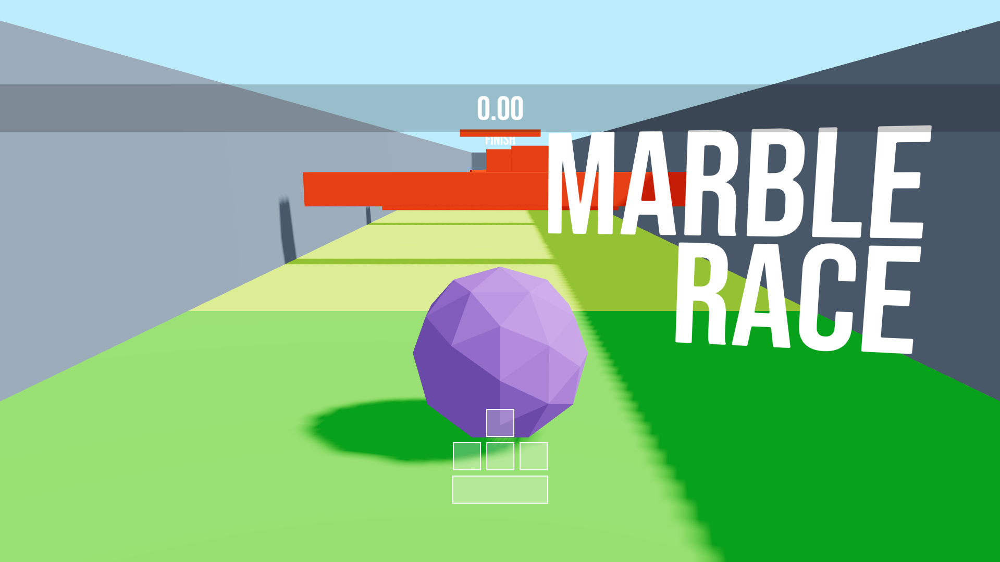

# 🌀 Marble Race Game

A **3D physics-based marble racing game** built with **React Three Fiber** and **Rapier Physics**. Navigate a randomly generated obstacle course and reach the finish line before falling off — every run is a new challenge!

## ✨ Features

* 🎮 **Realistic marble physics** with intuitive keyboard controls
* 🏁 **Randomly generated obstacle courses** on every restart
* ⏱️ **Live timer** with restart functionality
* 🎯 Variety of obstacles: spinners, moving blocks, swinging axes
* 🏆 **Reach the finish line** (featuring a hamburger!)
* 🔄 **New level every time** you restart

---

## 🧰 Technologies Used

* [React Three Fiber](https://docs.pmnd.rs/react-three-fiber) – 3D rendering with React
* [Rapier Physics](https://rapier.rs/) – High-performance physics engine
* [Zustand](https://zustand-demo.pmnd.rs/) – Lightweight state management
* [@react-three/drei](https://github.com/pmndrs/drei) – Useful helpers for R3F
* [Three.js](https://threejs.org/) – Core 3D library

---

## 🚀 Getting Started

### ✅ Prerequisites

* Node.js v16+
* npm v8+ or Yarn

### 📦 Installation

```bash
git clone https://github.com/aakanshakansal/marble-race.git
cd marble-race
npm install # or yarn install
```

### 🔧 Development

```bash
npm run dev # or yarn dev
```

Open your browser and visit:
👉 `http://localhost:5173`

### 📦 Build for Production

```bash
npm run build # or yarn build
```

To preview the production build:

```bash
npm run preview # or yarn preview
```

---

## 🗂️ Project Structure

```
marble-race/
├── public/
│   ├── hamburger.glb         # 3D model of the finish line
│   └── bebas-neue.woff       # Custom font
├── src/
│   ├── components/           # Main game components
│   │   ├── Experience.jsx    # Core scene setup
│   │   ├── Level.jsx         # Procedural level generation
│   │   ├── Player.jsx        # Marble control logic
│   │   ├── Lights.jsx        # Lighting configuration
│   │   └── Interface.jsx     # UI & timer
│   ├── stores/
│   │   └── useGame.jsx       # Zustand store for game state
│   ├── App.jsx               # App shell
│   └── main.jsx              # Entry point
├── .gitignore
├── package.json
├── README.md
└── vite.config.js            # Vite configuration
```

---

## 🎮 Controls

| Key   | Action        |
| ----- | ------------- |
| W / ↑ | Move forward  |
| A / ← | Move left     |
| S / ↓ | Move backward |
| D / → | Move right    |
| Space | Jump          |

---

## 🕹️ How to Play

1. Control your marble using the keyboard.
2. Avoid obstacles and don’t fall off the course.
3. Reach the hamburger at the finish line.
4. Click **"Restart"** to generate a new random level and try again!

---

## 📜 Development Scripts

| Command           | Description                      |
| ----------------- | -------------------------------- |
| `npm run dev`     | Start development server         |
| `npm run build`   | Build the project for production |


---

## 📸 Preview



---


